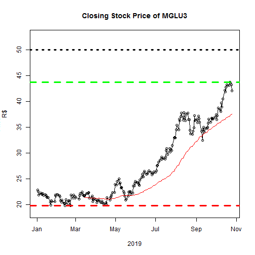

Shiny Web Application Predicting XXX
========================================================
author: Phillip Rowe     
date: November 4, 2019
autosize: true

To do
========================================================

1. create a Shiny application and deploy it on Rstudio's servers
2. useRstudio Presenter to prepare a reproducible pitch presentation about the app

Your Shiny Application must include the following:

x- Some form of input (widget: textbox, radio button, checkbox, ...)
x- Some operation on the ui input in server.R
x- Some reactive output displayed as a result of server calculations
- documentation that user would need to get started using app should be at the Shiny website 
- Share the app link by pasting it into the provided text box
- Share your server.R and ui.R code on github

Your Reproducible Pitch Presentation

- create a web page using Rstudio Presenter with an html5 slide deck to pitch the app (5 slides, inclusive of the title slide) 
- push presentation to github or Rpubs
- A link to your github or Rpubs presentation pasted into the provided text box
- must contain some embedded R code that gets run when slidifying the document
(Rstudio presenter has a button to publish directly to Rpubs https://support.rstudio.com/hc/en-us/articles/200714023-Displaying-and-Distributing-Presentations. Paste as http:// link not a https:// link.)

- can also publish using both formats to github manually using gh-pages, though your github branch must have a .nojekyll fle and be on a branch names gh-pages. 

Slide 2
========================================================

Your Shiny Application

- Was there enough documentation on the shiny site for a user to get started using the app?
- Did the app run as described?
- Was there some form of widget input (slider, textbox, radio buttons, checkbox, ...) in either ui.R or a custom web page?
- Did server.R perform some calculations on the input in server.R?
- Was the server calculation displayed in the html page?
- Was the app substantively different than the very simple applications built in the class? 

Your Reproducible Pitch

- contain an R expression that got evaluated and displayed?
- Was the server calculation displayed in the html page?
- tinker around with the default style? 
- no R errors displayed in the presentation.

Slide With Code
========================================================


```r
summary(cars)
```

```
     speed           dist       
 Min.   : 4.0   Min.   :  2.00  
 1st Qu.:12.0   1st Qu.: 26.00  
 Median :15.0   Median : 36.00  
 Mean   :15.4   Mean   : 42.98  
 3rd Qu.:19.0   3rd Qu.: 56.00  
 Max.   :25.0   Max.   :120.00  
```

Slide With Plot
========================================================



For more details on R presentations 
<https://support.rstudio.com/hc/en-us/articles/200486468>.
